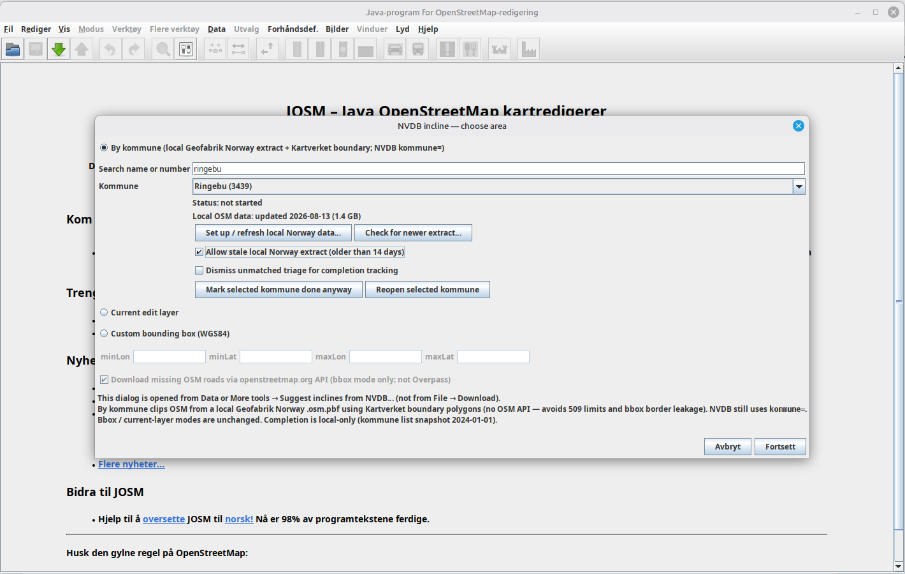
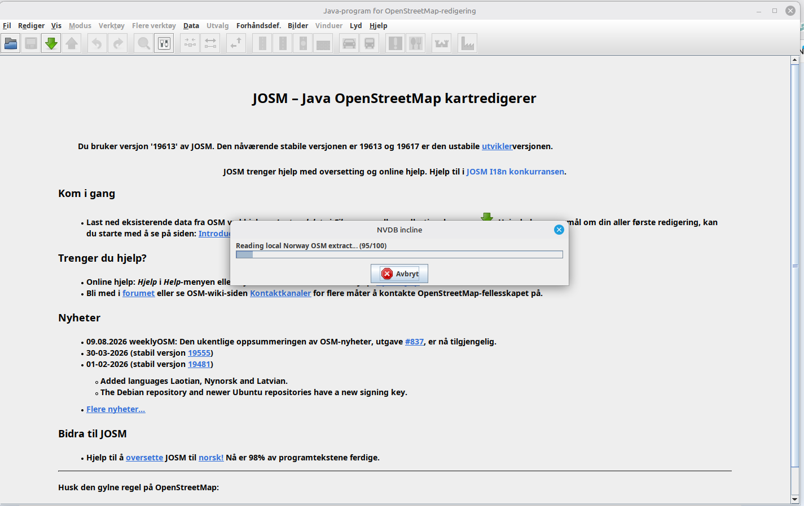
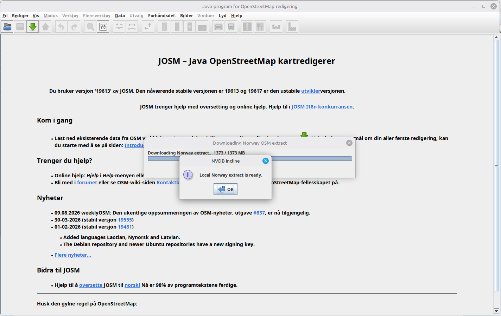
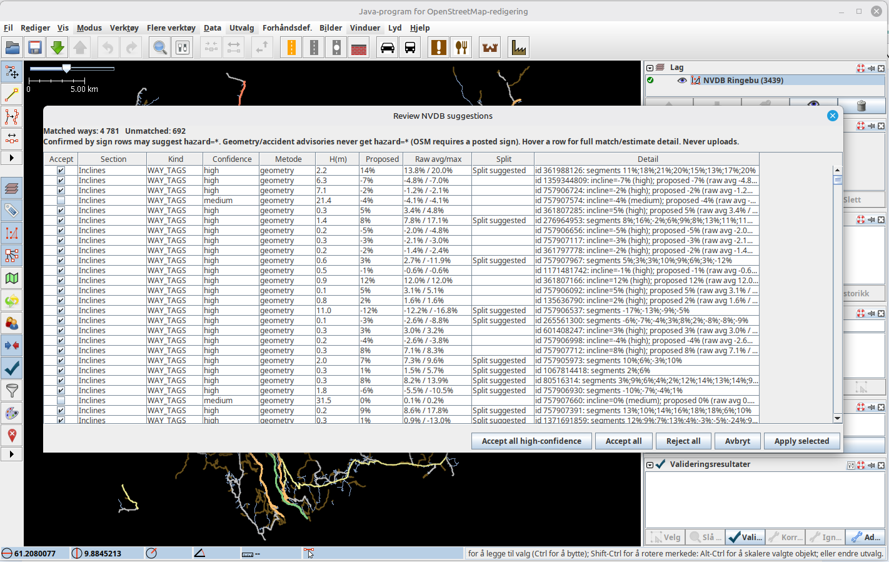
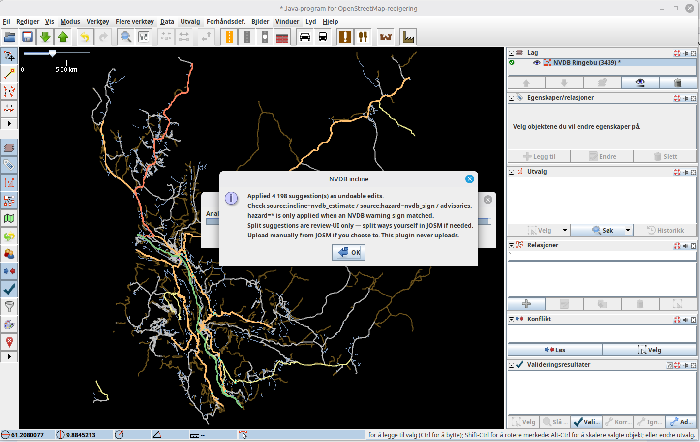

# josm-elevation (`nvdb_incline`)

JOSM plugin that helps Norwegian OSM mappers suggest `incline=*` tags, snow-chain advisory points, and (with strict tagging rules) sharp-curve / accident-cluster advisories, using data from Statens Vegvesen's NVDB API.

**This plugin never uploads to OpenStreetMap.** Accepted suggestions become ordinary undoable JOSM edits (`ChangePropertyCommand` / `AddCommand`). You only upload if you later use JOSM's own Upload action after review.

## Table of contents

- [Documentation](#documentation)
- [Modules](#modules)
- [APIs used](#apis-used)
- [Requirements](#requirements)
- [Build (short)](#build-short)
- [Install into your normal JOSM](#install-into-your-normal-josm)
- [Screenshots](#screenshots)
- [Review-before-apply workflow](#review-before-apply-workflow)
- [Kommune completion tracking (local only)](#kommune-completion-tracking-local-only)
  - [Existing incline / hazard tags (do not overwrite surveys)](#existing-incline-hazard-tags-do-not-overwrite-surveys)
- [Applied OSM tags reference](#applied-osm-tags-reference)
  - [Ways (incline suggestions)](#ways-incline-suggestions)
  - [Nodes — sign-backed hazard](#nodes-sign-backed-hazard)
  - [Nodes — snow-chain advisory (implemented)](#nodes-snow-chain-advisory-implemented)
  - [Nodes — unsigned advisories (implemented; never `hazard=*`)](#nodes-unsigned-advisories-implemented-never-hazard)
  - [Where confidence / estimate data goes](#where-confidence-estimate-data-goes)
- [Data accuracy and limitations](#data-accuracy-and-limitations)
  - [NVDB road geometry accuracy](#nvdb-road-geometry-accuracy)
  - [What this means for suggested `incline=*`](#what-this-means-for-suggested-incline)
  - [Considered and deferred: Mapterhorn / Kartverket 1 m DTM](#considered-and-deferred-mapterhorn-kartverket-1-m-dtm)
- [Manual review sample (`test-files/`)](#manual-review-sample-test-files)
- [OSM `hazard=*` tagging rule](#osm-hazard-tagging-rule)
- [Validator](#validator)
- [Tests](#tests)
- [Safety constraints](#safety-constraints)
- [Prototype (optional)](#prototype-optional)
- [Developer tools](#developer-tools)
- [License](#license)

## Documentation

| Doc | Contents |
|-----|----------|
| [`docs/build-and-dependencies.md`](docs/build-and-dependencies.md) | JDK/Gradle/JOSM versions, verified build/test/dist/run commands, install paths |
| [`docs/codebase-map.md`](docs/codebase-map.md) | Module map, responsibility → class table, end-to-end incline walkthrough |
| [`docs/debugging.md`](docs/debugging.md) | `runJosm` / `debugJosm`, logging reality, fixture capture, common failures |

## Modules

| Module | Role |
|--------|------|
| `core` | Pure JVM logic: gradient, OSM/NVDB matching, snow-chain heuristics, curvature detection, accident clustering, review accept/reject model. No JOSM dependency. |
| `plugin` | JOSM adapter: menu entry, NVDB HTTP client + cache, review dialog, Commands, validator. |
| `prototype/` | Earlier Python CLI (algorithm reference only; not needed to build or run the plugin). |

## APIs used

The plugin is **read-only** toward OpenStreetMap (never uploads). NVDB HTTP goes to
Statens vegvesen's [NVDB API Les](https://nvdbapiles.atlas.vegvesen.no).

| API / data | Base / path | Used for |
|-----|-------------|----------|
| NVDB Vegnett v4 | `GET /vegnett/api/v4/veglenkesekvenser/segmentert` | 3D segmented road-link geometry (`kartutsnitt` bbox **or** `kommune=`) |
| NVDB Vegobjekter v4 | `GET /vegobjekter/api/v4/vegobjekter/96` | Skiltplate (warning signs) |
| NVDB Vegobjekter v4 | `GET /vegobjekter/api/v4/vegobjekter/570` | Trafikkulykke |
| Geofabrik Norway PBF | `https://download.geofabrik.de/europe/norway-latest.osm.pbf` | **Kommune mode only** — local offline OSM extract (~1.3 GB; user-triggered download) |
| Kartverket boundaries | Bundled from Geonorge “Administrative enheter kommuner” GeoJSON EPSG:4258 | Kommune polygon clip (not NVDB-link bbox) |
| OSM map API | `api.openstreetmap.org` via JOSM | **Bbox mode only** (optional); not used for kommune mode |

**Kommune name list** is a bundled static snapshot (`kommuner_2024-01-01.json` from Regjeringen) — refresh with `tools/refresh_kommune_list.py`.

**Kommune boundaries** are a bundled simplified Kartverket snapshot
(`kommune_boundaries_2026-01-01.json`) — refresh with `tools/refresh_kommune_boundaries.py`.

The optional `prototype/` CLI additionally calls Overpass (`https://overpass-api.de/api/interpreter`) plus NVDB Datakatalog (`/datakatalog/api/v1/vegobjekttyper`) and kommuner (`/omrader/api/v4/kommuner`). `tools/capture_fixtures.py` talks only to JOSM Remote Control on localhost.

## Requirements

- JDK 17+ (build emits Java 17 bytecode; JDK 21 works)
- Network once to download Gradle/JOSM dependencies; afterwards `./gradlew test` can run from the dependency cache

Details: [`docs/build-and-dependencies.md`](docs/build-and-dependencies.md).

## Build (short)

```bash
./gradlew build
./gradlew test
./gradlew :plugin:dist          # → plugin/build/dist/nvdb_incline.jar
./gradlew :plugin:runJosm       # clean temp JOSM with this plugin
```

## Install into your normal JOSM

1. `./gradlew :plugin:dist`
2. Copy `plugin/build/dist/nvdb_incline.jar` into the JOSM plugins directory (Linux current: `~/.local/share/JOSM/plugins/`; see build doc for macOS/Windows/legacy).
3. Fully restart JOSM; enable **nvdb_incline** if needed.
4. Open **Data → Suggest inclines from NVDB…** (also under **More tools**; shortcut Alt+Shift+N)

## Screenshots

Kommune-mode flow (Ringebu example):

**Download local Norway extract** (Geofabrik `.osm.pbf`, ~1.3 GB — one-time / on refresh):



**Reading the local extract** while clipping to the kommune boundary:



**Area dialog with local extract ready** (By kommune, Kartverket boundary, NVDB `kommune=`):



**Review NVDB suggestions** (accept/reject before any tags are applied):



**Suggestions applied** to the edit layer (undoable; plugin never uploads):



## Review-before-apply workflow

1. Download an area in JOSM that contains Norwegian `highway=*` ways (many already carry `nvdb:id` from Elveg).
2. **Data → Suggest inclines from NVDB…** (or **More tools**; Alt+Shift+N)
3. Choose an **area mode** in the selection dialog (opened from this menu — not from File → Download):
   - **By kommune** — requires a local Geofabrik Norway `.osm.pbf` (Set up / refresh in the dialog; ~1.3 GB). Clips highways with Kartverket kommune polygons, then fetches NVDB with `kommune=`. Does **not** call the OSM API (avoids 509 bandwidth limits and bbox border leakage). After extract, the plugin **scans the downloaded ways for existing tags** (`incline=*`, `source:incline=*`, `hazard=*`, `source:hazard=*`, `chain_advisory=*`) so you can see whether that kommune already looks fixed on OSM — from this tool, other mappers, or surveys — before you review new suggestions.
   - **Current edit layer** — existing behaviour (NVDB bbox = layer envelope).
   - **Custom bounding box** — WGS84 min/max; optional OSM download; NVDB queried with `kartutsnitt`.
4. The plugin fetches (cached under JOSM's cache directory):
   - NVDB segmented road-link geometry (3D) for inclines
   - NVDB Skiltplate (type **96**) for Farlig sving / Farlig vegkryss codes
   - NVDB Trafikkulykke (type **570**) for accident clustering
5. A **review dialog** lists every proposal in sections (inclines, snow chains, curves confirmed by sign, geometry-only curves, accident clusters). Tick only what you accept. Shortcut: “Accept all high-confidence”.
6. **Apply selected** registers undoable edits using only the tags in [Applied OSM tags](#applied-osm-tags-reference) below. After a kommune run, local completion stats update automatically.
7. Spot-check against imagery, signs, and local knowledge. Ways that already have human/surveyed `incline=*` are not overwritten (discrepancy notes only). Prior `source:incline=nvdb_estimate` values can appear as **update** suggestions if the estimate changed. Dubious track/path matches and absurd grades are filtered before they reach the review list. When a split is useful, the review dialog shows a **Split suggested** badge — splitting is done with JOSM's own tools, not via OSM tags.
8. Upload manually from JOSM only after that review. Ctrl+Z undoes plugin edits like any other change.

## Kommune completion tracking (local only)

When you work **By kommune**, the plugin keeps a personal progress file under the JOSM preferences directory (`…/nvdb_incline/kommune_completion.json`):

- Matched / accepted / rejected / pending counts and last-run time for that kommunenummer
- Optional “dismiss unmatched”, “mark done anyway”, and “reopen”
- **Existing-tag check on the download:** after the kommune is clipped from the local Geofabrik extract and matched to NVDB, the plugin counts how many matched ways already carry `incline=*` (and related hazard/chain tags). That tells you whether the kommune looks already fixed on OSM — not only what *this machine* has reviewed. The kommune status line shows e.g. “Existing incline coverage: 34% (12% previously suggested by this tool, 22% other/surveyed)”. Substantial other/surveyed coverage may offer “mark as reviewed?”; it never auto-marks done.
- **Never uploaded, never shared** — the personal checklist does not track other contributors’ machines; the coverage line above is what is *on the extract*, from any source.

A kommune is treated as done when every matched incline decision is accepted or rejected, unmatched triage is dismissed (or zero), unless you override manually.

### Existing incline / hazard tags (do not overwrite surveys)

After matching, each way is classified:

| Existing tags | Review behaviour |
|---------------|------------------|
| No `incline=*` | Fresh suggestion (as before) |
| `incline=*` + `source:incline=nvdb_estimate` | **Update** suggestion if the new estimate differs meaningfully (“Update: 6% → 8%”) |
| `incline=*` with other/no `source:incline` | **Discrepancy note** only — never an applyable Command; human/surveyed data is kept |

The same three-way logic applies to `hazard=*` / `source:hazard=*` on ways. Discrepancy notes are informational only.

## Applied OSM tags reference

Source of truth: `AppliedTags`, `SuggestionApplier.sanitizeTags`, `SafetyAnalyzer`, `ReviewModel.chainTags`. Only these keys are written to the data layer on Apply.

### Ways (incline suggestions)

| Tag | Example | When applied | Note |
|-----|---------|--------------|------|
| `incline` | `7%`, `-11%` | Accepted **fresh** or **update** way row | Signed integer percent relative to **way node order** ([OSM incline](https://wiki.openstreetmap.org/wiki/Key:incline)); produced by `InclineTags.formatIncline` from NVDB 3D geometry. Split cases still get one whole-way average value. Human-sourced `incline=*` (other/no `source:incline`) is never overwritten — only a discrepancy note. |
| `source:incline` | `nvdb_estimate` | Always with a new incline suggestion | OSM **`source:<key>`** prefix convention (“source of this attribute”), not `incline:source`. See [Key:source](https://wiki.openstreetmap.org/wiki/Key:source). Marks a machine estimate from NVDB geometry — see [Data accuracy and limitations](#data-accuracy-and-limitations). |
| `fixme` | `NVDB-estimated incline; verify in field before keeping. Source is NVDB 3D geometry, not a survey.` | With incline suggestion | English machine-estimate flag so unfinished guesses are hard to miss before upload. |
| `note` | `Maskinelt NVDB-estimat, ikke feltverifisert. Kontroller mot skilt/terreng.` | With incline suggestion | Norwegian mapper-facing hint; same intent as `fixme`. |

### Nodes — sign-backed hazard

| Tag | Example | When applied | Note |
|-----|---------|--------------|------|
| `hazard` | `dangerous_junction` or `curve` | **Only** when an NVDB warning skilt matched (`signConfirmed`) | Deliberate safety rule: OSM `hazard=*` requires a posted sign / official marking — never from geometry or accident counts alone. |
| `source:hazard` | `nvdb_sign` | With `hazard=*` | Prefix form; value means the hazard suggestion is backed by NVDB Skiltplate data. |
| `fixme` | e.g. `NVDB-sign-backed hazard=dangerous_junction suggestion; verify posted sign on site.` | With `hazard=*` | Still asks for field check of the physical sign. |
| `note` | Norwegian text citing skiltnummer / context | With `hazard=*` | Human-readable justification. |

### Nodes — snow-chain advisory (implemented)

| Tag | Example | When applied | Note |
|-----|---------|--------------|------|
| `chain_advisory` | `fit` or `remove` | Accepted chain row | **Not** an established Norwegian OSM tagging scheme — review-only hint from grade/tunnel heuristics (`ChainAdvisory`). |
| `source:chain_advisory` | `nvdb_estimate` | With `chain_advisory` | Prefix form; marks machine origin. |
| `note` | `Foreslatt kjettingplass …` / `Foreslatt kjettingavtakingspunkt …` | With `chain_advisory` | Norwegian text from `InclineTags.CHAIN_NOTE_*`. |

### Nodes — unsigned advisories (implemented; never `hazard=*`)

| Tag | Example | When applied | Note |
|-----|---------|--------------|------|
| `safety_advisory` | `sharp_curve` or `accident_cluster` | Geometry-only sharp curve, or accident cluster **without** matching skilt | Explicitly **not** `hazard=*`. Count/period for clusters live in `note`, not separate OSM keys. |
| `note` | Explains advisory + “IKKE hazard=* …” | With `safety_advisory` | Keeps the legal/tagging constraint visible to mappers. |

### Where confidence / estimate data goes

Former bookkeeping tags such as `incline:match_confidence`, `incline:match_method`, `incline:match_hausdorff_m`, `incline:estimated_avg`, `incline:estimated_max_sustained`, `incline:suggested`, `incline:suggested_segments`, and `incline:split_recommended` are **not** written to OSM objects.

They remain available to reviewers as structured `InclineAudit` data on each incline review row and are shown in the review dialog (Method, H(m), Proposed, Raw avg/max, Split columns, plus hover tooltips). There is currently **no** sidecar debug log file for this data — see [`docs/debugging.md`](docs/debugging.md).

Do not reintroduce `incline:source` / `hazard:source`; use `source:incline` / `source:hazard`.

## Data accuracy and limitations

This section sets expectations for anyone reading suggested `incline=*` tags or reviewing related changes. Figures below are taken from NVDB / Kartverket product documentation; they are not measurements produced by this plugin.

### NVDB road geometry accuracy

Elevation along road links comes from **NVDB’s own captured 3D road geometry**, not from a separate national terrain model.

NVDB product documentation for the road network describes detailed data that is mostly registered **photogrammetrically** from aerial imagery with image resolution between **7 and 25 cm**. Stated positional accuracy (**stedfestingsnøyaktighet**) varies from about **±0.10 m to ±2 m**, depending on object type, area type, and capture method — a range, not a single fixed tolerance. (See e.g. [NVDB Rutedatasett produktspesifikasjon](https://dokument.geonorge.no/produktspesifikasjoner/nvdb-rutedatasett/Versjon%202.0/Rutedatasett.html), sections on detaljnivå / stedfestingsnøyaktighet.)

NVDB’s data model can carry per-feature quality metadata (for example height accuracy in centimetres and capture method, as in SOSI / FKB-style `Posisjonskvalitet` fields such as `nøyaktighetHøyde` and `datafangstmetode`). **This plugin does not fetch or surface that metadata today.** `NvdbClient.parseLink` keeps WKT geometry, `medium`, positions, and a few type fields on `NvdbLink`; there is no accuracy field on the model and nothing in matching / review UI that reports per-link height accuracy. Treating that as unused input would be wrong — it is simply not read.

Rural and mountain roads (this plugin’s most relevant use case) are **plausibly** toward the coarser end of NVDB’s stated accuracy range, but that has **not** been independently confirmed here. Treat it as a caveat when reviewing steep passes, not as a measured fact.

### What this means for suggested `incline=*`

Every incline suggestion is an **estimate** derived from that geometry. That is why applied tags use `source:incline=nvdb_estimate` plus `fixme=*` / `note=*`, not a surveyed claim.

Plugin processing adds further approximation on top of whatever geometry accuracy the link has:

- Gradients are computed from Z sampled along the matched OSM way (average and max-sustained window statistics).
- Suggested tags are rounded to a **whole-percent** integer (`InclineTags.formatIncline`).
- Split cases still publish one whole-way average `incline=*` on apply; segment breakdown stays in the review UI.

A suggested value such as `8%` should not be read as more precise than the underlying NVDB geometry and these estimation choices support. Field check against signs and terrain remains the rule.

### Considered and deferred: Mapterhorn / Kartverket 1 m DTM

[Kartverket’s national 1 m DTM](https://kartverket.no/api-og-data/terrengdata) (also redistributed for web use via the [Mapterhorn](https://mapterhorn.com/) open terrain-tile project, which lists Norway country-wide at 1 m) is a **terrain** product based largely on airborne laser scanning, with image-matching (bildematching) used in some areas. Where laser was used, FKB-Laser product classes such as **DTM10** (a common NDH ordering level) target **0.10 m** systematic deviation for absolute height accuracy on hard, well-defined horizontal control surfaces — tighter than NVDB’s worst-case road-geometry tolerance of ±2 m. That made a DTM cross-check worth considering as an independent check on suggested grades.

It was **not adopted**. Reasons, recorded so they are not re-litigated from scratch or forgotten:

1. **Weakest exactly where most needed.** Kartverket documents that over larger contiguous areas above the treeline (little vegetation), height data for the national detailed elevation model was produced with **bildematching** rather than laser, specifically because laser coverage was not funded there; accuracy is described as somewhat poorer than laser, though judged adequate for mountain areas. ([Status høydemodell](https://kartverket.no/geodataarbeid/nasjonal-detaljert-hoydemodell/status-hoydemodell).) This plugin’s steepest, highest-value roads sit in that regime — so the DTM’s accuracy advantage over NVDB’s own photogrammetric road geometry narrows or disappears on exactly those mountain passes.

2. **Terrain ≠ road surface.** A DTM is bare-earth elevation. On bridges, in tunnels, on embankments, and in cuttings, the road’s real elevation can legitimately diverge from the terrain under/around it. A naive Z cross-check would flag false anomalies on those segments unless tunnel/bridge (and similar) cases were explicitly excluded — real complexity for a still-unproven benefit.

3. **New dependency for unconfirmed payoff.** Using the DTM would mean adding raster / GeoTIFF (or tile) reading to a `core` module that currently has **no** such dependency, before there is concrete evidence (for example a measured rate of unmatched ways or systematically wrong NVDB grades) that a second source is needed.

**Revisit if** real-world use shows either (a) a meaningful share of ways failing to match any NVDB link (where a DTM-based fallback estimate might help), or (b) NVDB-derived gradients wrong often enough in practice to justify a second independent source plus tunnel/bridge exclusion work. Until then this stays a **documented option**, not an open task. Mapterhorn / Kartverket DTM data is **not** used by the plugin today.

## Manual review sample (`test-files/`)

Real-world Innlandet OSM extract used for end-to-end plugin QA (Friisvegen / Vekkomsvegen area):

| File | Contents |
|------|----------|
| `test-files/test.osm` | Input layer before suggestions |
| `test-files/test-out.osm` | Same area after running the plugin and applying selected suggestions (example output only; not authoritative OSM data) |

Open `test.osm` in JOSM, run **Suggest inclines from NVDB…**, and optionally compare with `test-out.osm`. Automated coverage remains under `tests/fixtures/steep_roads/` and the unit tests.

## OSM `hazard=*` tagging rule

OSM documents `hazard=*` for hazards backed by a **posted traffic sign** (or official declaration), not raw accident counts. This plugin follows that:

| Finding | Tag outcome |
|---------|-------------|
| Sharp curve **and** nearby NVDB Farlig-sving skilt (e.g. 100.1 / 100.2 / 102.x) | May suggest `hazard=curve` (high confidence) |
| Sharp curve, **no** matching sign | Advisory only (`safety_advisory=sharp_curve`) |
| Accident cluster **and** matching Farlig vegkryss / curve skilt | May suggest `hazard=dangerous_junction` or `hazard=curve` |
| Accident cluster, **no** matching sign | Advisory only (`safety_advisory=accident_cluster` + count/period in `note=*`) |

Accident statistics alone never produce `hazard=*`. Construction and apply paths reject unsigned `hazard=*` (see `HazardTagSafetyTest`).

## Validator

Ways with `source:incline=nvdb_estimate` get a validator reminder so unfinished estimates are harder to upload by accident.

## Tests

```bash
./gradlew test
```

- **`core`**: JUnit 5 — gradient, matching, chain heuristics, curvature, sign cross-check, accident clustering, review/`InclineAudit` filtering. No JOSM, no network in the tests themselves.
- **`plugin`**: headless in-memory `DataSet` tests for Command apply/undo; offline NVDB fixture parse; **no-upload** safety grep; **hazard tag-safety** regression; **steep-road fixtures** under `tests/fixtures/steep_roads/`.

## Safety constraints

- No `UploadAction`, no OSM changeset/write API calls, no OAuth
- Working OSM data comes from the active JOSM layer, or (kommune mode) a local Geofabrik Norway extract clipped by Kartverket polygons; NVDB is fetched over HTTP (no Overpass in this plugin)
- Kommune completion JSON is local bookkeeping only (preferences dir) — never uploaded or shared
- `hazard=*` only after NVDB sign confirmation; geometry/accident advisories stay `note=*` / `safety_advisory=*`
- Safety regression tests run on every `./gradlew test`

## Prototype (optional)

The Python CLI under `prototype/` was an earlier standalone experiment. See `prototype/README.md` if you want to run those offline tests for comparison.

## Developer tools

`tools/capture_fixtures.py` drives a running JOSM Remote Control session to load/export steep-road OSM fixtures (never uploads). `tools/refresh_kommune_list.py` refreshes the bundled kommune snapshot. See `tools/README.md` and [`docs/debugging.md`](docs/debugging.md).

## License

Plugin code is intended for use with JOSM (GPL). Treat redistribution of the built plugin accordingly. The `prototype/` Python code remains separately usable as reference tooling.
